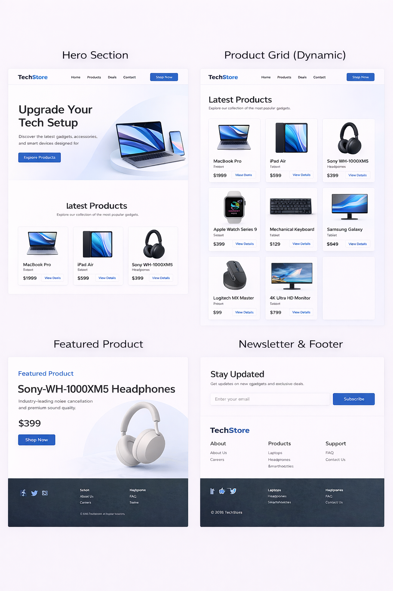

# TechStore – Product Showcase Page

[View Live Website Here](https://anaid-ariwany.github.io/TechStore/)

## Project Goal

To build a **tech product showcase page** (Dynamic DOM Rendering) where all products are stored in **JavaScript**, and JavaScript dynamically generates the product cards inside the HTML page.

Instead of writing product cards manually in HTML, JavaScript will **create them for me**.

## What This Project Teaches

The goal is to learn the **fundamental model of frontend development**:

### _Skills This Project Builds_

* DOM selection
* DOM creation
* Data structures
* Arrays and objects
* Rendering UI with JavaScript
* Clean component layout
* Dynamic content generation
* Separation of concerns (data vs. presentation)
* Building reusable components

## Visual Direction

This should look like a **modern tech product store**.

